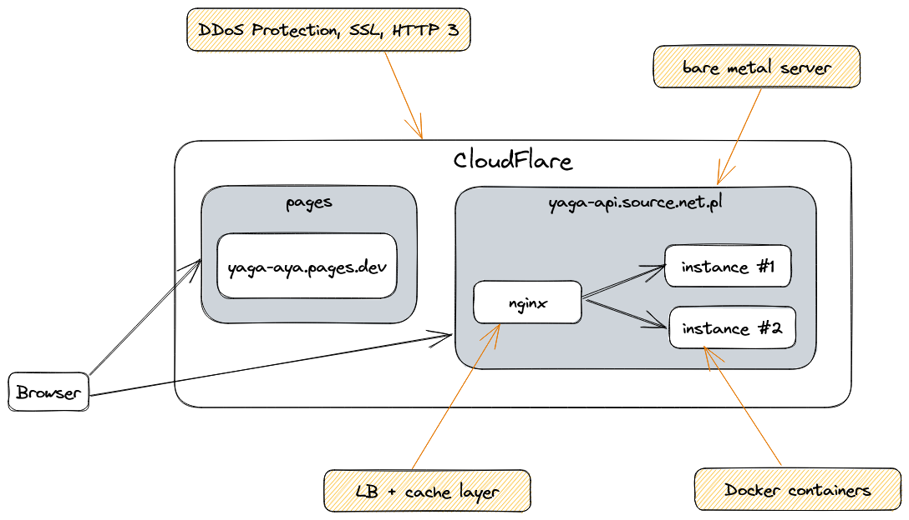

# YAGA - Yet Another Github App
The goal of this project is to create a GitHub App that can be used to search repo and display a table of results.
A backend application acts like proxy between the frontend and GitHub API and caches the results.
Moreover, default Github API's response has a lot of fields that are not used in the frontend app.
The backend app filters the response to return only the fields that are used, so we reduce the transfer and speedup frontend part (less data to parsing).

# Development

## Prerequisites
Make sure you have the following installed:
- nvm - (recommended) - for managing node versions
- Node.js - v19
- pnpm - v8
- docker

## How to run
1. Clone the repo
1. Run `pnpm install`
1. Run `pnpm dev`

## Frontend
A frontend app is deployed on CloudFlare Pages.
The app is configured by environment variable `NEXT_PUBLIC_API_URL` which points to the backend app:
 - production - https://yaga-api.source.net.pl
 - development - http://localhost:3001

## Backend
A backend app is deployed on my private server.
The app is configured by environment variable:
 - `GITHUB_PAT` - GitHub Personal Access Token (PAT) - used to authenticate with GitHub API
 - `CORS_ORIGIN` - CORS origin - used to allow CORS requests from the frontend app ('*' by default)
 - `PORT` - port on which the app will be listening (3001 by default)

# Architecture

# CI/CD
GitHub actions are used to build and test the app.
## Docker image
A docker image is pushed to the Docker registry.
You can find the latest version here: https://hub.docker.com/r/ar4s/yaga-api

# Mini Architecture Decision Records
## Frontend and backend apps
I decided to split the app into two apps:
- frontend - Next.js
- backend - Nest.js

The main reason for this is to separate the frontend and backend concerns.
This will make it easier to scale and maintain the app in the future.

## pnpm
I am familiar with pnpm and I like it because it is fast and it has a lot of features, like:
 - `pnpm deploy` to create easily dedicated `node_modules` with production dependencies
 - `pnpm --filter '<package>...'` to build only specific package and its dependencies

## Next.js
I chose Next.js because it is a framework that I am familiar with and it is easy to get started.
It also has a lot of features that I can use to speed up development:
  - SSR or SSG - to improve SEO and performance (caching on the edge)
  - routing - to create URLs
  - API routes - to create API endpoints and for example to proxy requests to the backend

## Nest.js
It is a framework that I am familiar with and it is easy to get started with.
I could also have used for example `fastify` or `express` but the boilerplate code would be much bigger.
I used features from the framework:
  - Dependency injection - to create loosely coupled components
  - Pipes - to validate data
  - Interceptors - to create logging and error handling, etc.

## Docker
It's easy to build and run the app with docker. You can also use docker-compose to run the app locally when the architecture will grow.

# Known issues
## Cache with Redis
I found some issues with the standard Redis cache manager in Nest.js, so I decided to drop this approach and implemented cache via `nginx`.

# Monitoring
There is some basic monitoring based on `prometheus` and `influx`, please go to [dashboard for more information](https://influx.source.net.pl/orgs/3a7c2facbd09c15a/dashboards/0afb3b47d1d51000?lower=now%28%29%20-%201h).

# Error logging
I used Sentry to log errors on backend side.

# TODO
- [ ] Add more tests
- [ ] Add feature - logging frontend errors to Sentry
- [ ] Add feature - latest search list
- [ ] Add feature - sort by name, etc.
- [ ] Add feature - pagination
- [ ] Add feature - dark mode
- [ ] Add syntehic tests results to README.md - lighthouse (front) and wrk2 (back)
